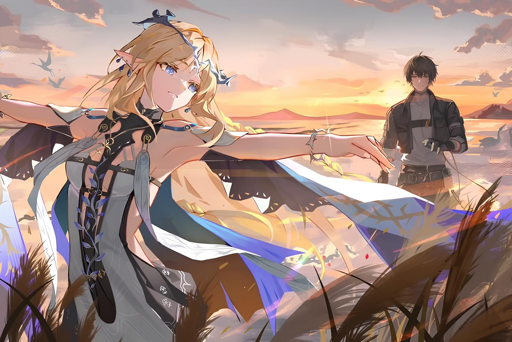
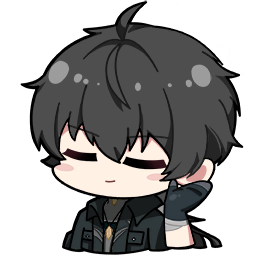
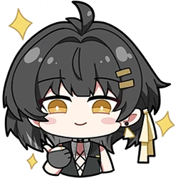
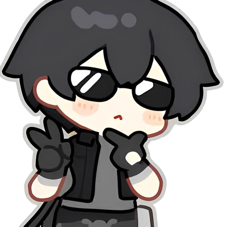
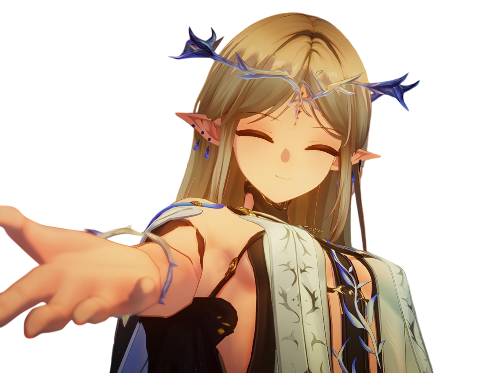

<!-- Banner -->

  

<!-- Tanıtım Yazısı -->

  <h3 align="center">About Me </h3>
 

  

<strong>Hey, I'm Aerin.</strong> 
A full stack developer who enjoys building thoughtful systems — sometimes through frontend animations, sometimes through backend logic. 
Currently focused on <strong>AI-integrated applications</strong> and <strong>emotionally-aware characters</strong> that respond with nuance and personality. 
 
Beyond code, I spend time immersed in <em>Wuthering Waves</em>, get lost in anime, and drift through imagined worlds where fantasy and emotion meet.  
These quiet obsessions inspire the interfaces I design and the architectures I build. 
 
Still learning, still evolving — one commit, one story, one dream at a time. 
As time allows, I’ll be uploading fun, cozy, and heartwarming projects that reflect a part of me.
  

<!-- Tech Stack GIF  -->
<h3 align="left">Languages</h3>

  <!-- Sol: Languages -->

  <!-- Right: GIF -->
  

 

<h3 align="left">Tools & Tech</h3>

  <!-- Right: GIF -->
  

 

<!-- Projects -->
## 📂 My Projects

###  Pheeb – AI Chat Discord Bot

###  Yumeta — A Shared Anime & Manga Universe

---

<!-- Contact Me -->

  <i>
    I'm someone who's always curious,  
    eager to explore and learn new things.  
    Though I never quite feel complete,  
    I believe every step brings me closer.   
    If you have a thought or idea,  
    don't hesitate to reach out—  
    I'm just a message away.
  </i>

 

   

 

 

<!-- Byee -->

  

  <h3 align="center" style="font-weight: normal; font-family: 'Segoe UI', sans-serif;">
    Thanks for stopping by. More cozy & creative projects coming soon 🌙
  </h3>
   
  

