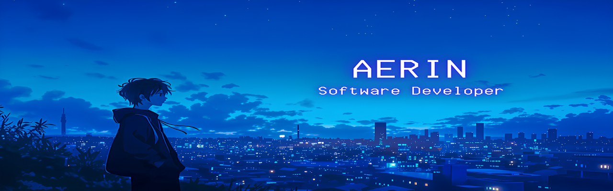

<body>

<h1 align="center">⬇️ 𝙒𝙚𝙡𝙘𝙤𝙢𝙚 𝙩𝙤 𝙈𝙮 𝙋𝙧𝙤𝙛𝙞𝙡𝙚 ⬇️</h1>
 

  <!-- Replace with your own futuristic/dark-themed banner GIF -->
  

 

  <h2 align="center">💬 𝘼𝙗𝙤𝙪𝙩 𝙈𝙚 🗨️</h2>
  
  <ul>
    <li><b>Name:</b> Aerin</li>
    <li><b>Hobby:</b> Full-stack web development, AI/ML experimentation, UI/UX design, exploring new tech</li>
    <li><b>Interests:</b> Responsive design, API architecture, pre-trained model fine-tuning, Tailwind CSS animations</li>
    <li><b>Fun Fact:</b> Always looking for the next challenge—whether it's debugging a REST endpoint or training a new model in LM Studio.</li>
  </ul>
  
<b>Thanks for stopping by to learn a bit about me! 😊</b>

 

  <h2 align="left">📇 𝙆𝙣𝙤𝙬𝙡𝙚𝙙𝙜𝙚 / 𝙆𝙣𝙤𝙬𝙣 𝙖𝙗𝙤𝙪𝙩 📇</h2>
  
  

    

       
       
       
       
       
       
        
       
       
       
       
        
       
       
       
       
      
    

    

      Primarily working on front-end with <b><i>HTML, CSS, JavaScript</i></b> and <b><i>Tailwind CSS</i></b>, backed by 
      <b><i>PHP, ASP.NET, Python</i></b> on the server. Database experience in <b><i>MySQL</i></b>, <b><i>MongoDB</i></b>,
      and experimenting in <b><i>LM Studio</i></b> for AI/ML. Version control and workflows managed with 
      <b><i>Git, GitHub, VS Code, Postman, Figma</i></b>.
    

  

 

<h2 align="center">⌨️ 𝙒𝙤𝙧𝙠 / 𝙋𝙧𝙤𝙟𝙚𝙘𝙩𝙨 🖱️</h2>

  

  <b>Full Stack Web Projects</b> 
  Websites built from scratch using HTML, CSS, JavaScript, PHP, Python, and ASP.NET. Focused on responsive design and seamless functionality.  
  <b>Backend &amp; API Development</b> 
  Built RESTful APIs in PHP and ASP.NET, managing server-side logic, authentication flows, and robust database integrations.  
  <b>AI Projects with Python</b> 
  Developing AI-driven solutions with Python, exploring pre-trained models via LM Studio and experimenting with custom model fine-tuning.  
  <b>Frontend Development</b> 
  Crafting responsive, interactive UI components with HTML, CSS, JavaScript, and Tailwind CSS animations.

 

<h2 align="right">📝 𝘾𝙤𝙣𝙩𝙖𝙘𝙩 𝙈𝙚 📝</h2>

  Feel free to reach out:  
  
  
  
    
  📱: (<b>+XX</b>) XXX XXX XXXX

 

  
  

   

  <h2 align="center" style="margin-bottom: 0;">💖 𝙏𝙝𝙖𝙣𝙠𝙨 𝙛𝙤𝙧 𝙫𝙞𝙨𝙞𝙩𝙞𝙣𝙜 𝙢𝙮 𝙥𝙧𝙤𝙛𝙞𝙡𝙚! 💖</h2>
  

    
  

  

</body>

